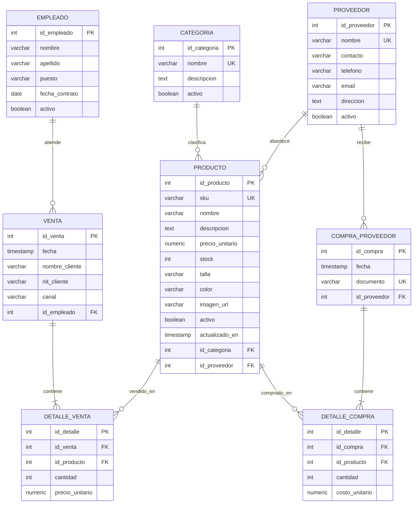

# Diseno de Base de Datos

## Alcance

El sistema modela una tienda de ropa formal llamada Atelier Formal. El objetivo es gestionar productos por categoria, proveedores, empleados, ventas, detalle de venta, compras a proveedor y detalle de compra. El backend usa SQL explicito contra PostgreSQL.

## Diagrama ER

## Modelo relacional

- `CATEGORIA(id_categoria PK, nombre UQ, descripcion, activo)`
- `PROVEEDOR(id_proveedor PK, nombre UQ, contacto, telefono, email, direccion, activo)`
- `EMPLEADO(id_empleado PK, nombre, apellido, puesto, fecha_contrato, activo)`
- `PRODUCTO(id_producto PK, sku UQ, nombre, descripcion, precio_unitario, stock, talla, color, imagen_url, activo, actualizado_en, id_categoria FK -> CATEGORIA.id_categoria, id_proveedor FK -> PROVEEDOR.id_proveedor)`
- `VENTA(id_venta PK, fecha, nombre_cliente, nit_cliente, canal, id_empleado FK -> EMPLEADO.id_empleado)`
- `DETALLE_VENTA(id_detalle PK, id_venta FK -> VENTA.id_venta, id_producto FK -> PRODUCTO.id_producto, cantidad, precio_unitario)`
- `COMPRA_PROVEEDOR(id_compra PK, fecha, documento UQ, id_proveedor FK -> PROVEEDOR.id_proveedor)`
- `DETALLE_COMPRA(id_detalle PK, id_compra FK -> COMPRA_PROVEEDOR.id_compra, id_producto FK -> PRODUCTO.id_producto, cantidad, costo_unitario)`

## Normalizacion hasta 3FN

Punto de partida no normalizado: una tabla unica de ventas mezclaria cliente, empleado, producto, categoria, proveedor, detalle vendido y compras a proveedor. Esto produciria grupos repetidos de productos, datos duplicados de proveedor y anomalias al cambiar precios o stock.

1FN:

- Cada atributo guarda valores atomicos.
- El detalle de venta y detalle de compra separan las lineas repetidas.

2FN:

- Las entidades con conceptos independientes se separan: producto, categoria, proveedor, empleado, venta y compra.
- Los datos de producto no dependen parcialmente de una venta; solo la cantidad y precio aplicado viven en `detalle_venta`.

3FN:

- `categoria.nombre` y `proveedor.nombre` no se duplican en producto, solo se referencian por llave foranea.
- Los datos de empleado no se duplican en ventas.
- La compra a proveedor separa encabezado y detalle, evitando dependencias transitivas entre documento, proveedor y productos comprados.

## Indices

- `idx_producto_categoria`: acelera filtros por categoria en catalogo y CRUD.
- `idx_venta_fecha`: acelera reportes por historial de ventas.
- `idx_detalle_venta_producto`: acelera top productos y productos sin ventas.
- `idx_producto_nombre_lower`: acelera busquedas por nombre normalizado.

## Vista

`vw_resumen_ventas` agrupa encabezado, empleado, lineas, unidades y total. El backend la usa en `/api/dashboard` y `/api/reports/sales-summary`.

## Consultas de la aplicacion

- `JOIN`: catalogo de productos, ventas por categoria, top productos.
- Subqueries: sugerencias de reposicion con `IN`; productos sin ventas con `NOT EXISTS`.
- `GROUP BY`, `HAVING` y agregaciones: reporte de ventas por categoria.
- CTE: reporte top productos.
- Transaccion explicita: `POST /api/sales` ejecuta `BEGIN`, valida stock con `FOR UPDATE`, inserta venta y detalle, actualiza stock, y usa `COMMIT` o `ROLLBACK`.
